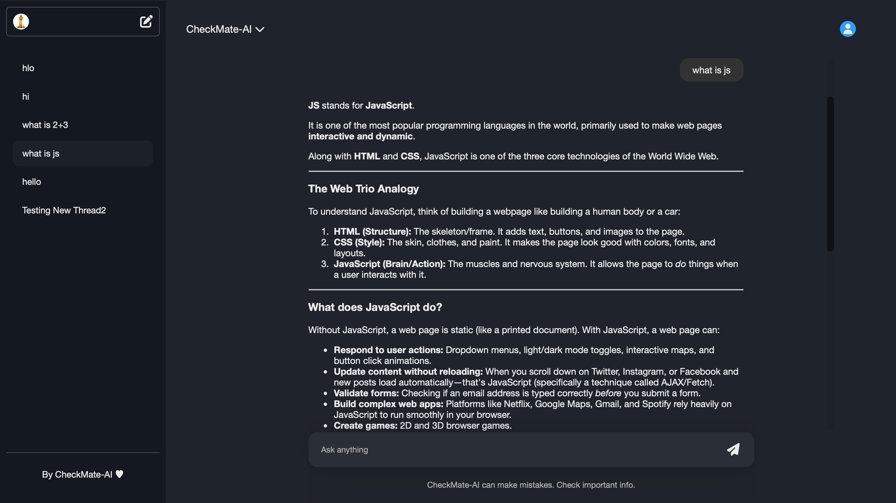

<div align="center">

# 🤖 CheckMate-AI

**A full-stack AI chat application powered by Google Gemini**

Create chat threads, converse with AI, and manage your conversation history — all in a sleek, dark-themed interface.

[](https://react.dev/)
[](https://nodejs.org/)
[](https://expressjs.com/)
[](https://www.mongodb.com/)
[](https://ai.google.dev/)
[](https://render.com/)

[Live Demo](https://checkmate-ai-backend.onrender.com) · [Report Bug](https://github.com/Sharmagireesh/CheckMate-AI/issues) · [Request Feature](https://github.com/Sharmagireesh/CheckMate-AI/issues)

</div>

---

## 📸 Dashboard Preview

<div align="center">



</div>

---

## 📖 Table of Contents

- [About the Project](#-about-the-project)
- [Features](#-features)
- [Tech Stack](#-tech-stack)
- [How It Works](#-how-checkmate-ai-works)
- [Project Structure](#-project-structure)
- [API Endpoints](#-api-endpoints)
- [Environment Variables](#-environment-variables)
- [Installation & Local Setup](#-installation-and-local-setup)
- [Deployment](#-deployment)
- [Security](#-security)
- [Current Functionalities](#-current-functionalities)
- [Roadmap / Future Improvements](#-roadmap--future-improvements)
- [Learning Outcome](#-learning-outcome)
- [Contributing](#-contributing)
- [License](#-license)
- [Author](#-author)
- [Disclaimer](#-disclaimer)
- [Support](#-support)

---

## 📌 About the Project

**CheckMate-AI** is a full-stack AI chat application built using **React**, **Node.js**, **Express.js**, **MongoDB**, and the **Google Gemini API**.

The application allows users to create chat threads, send messages, receive AI-generated responses, view previous conversations, and delete chat threads — all wrapped in a clean, responsive, dark-themed UI.

---

## ✨ Features

- 🧠 AI-powered chat using the Google Gemini API
- 🧵 Create multiple chat threads
- 💾 Store chat history in MongoDB
- 📜 View previous conversations
- 🗑️ Delete chat threads
- ⚛️ React-based frontend
- 🚀 Express.js backend
- ☁️ MongoDB Atlas integration
- 🔄 Context-based state management
- 🌙 Responsive dark-themed user interface
- 📡 Deployed using Render

---

## 🛠️ Tech Stack

<table>
<tr>
<td valign="top" width="33%">

**Frontend**
- React
- Vite
- JavaScript
- CSS
- React Context API
- UUID
- Font Awesome

</td>
<td valign="top" width="33%">

**Backend**
- Node.js
- Express.js
- MongoDB
- Mongoose
- Google Gemini API
- CORS
- dotenv

</td>
<td valign="top" width="33%">

**Deployment**
- Render
- MongoDB Atlas
- GitHub

</td>
</tr>
</table>

---

## ⚙️ How CheckMate-AI Works

1. The user enters a message in the React frontend.
2. The frontend sends the message and thread ID to the Express backend.
3. The backend sends the user message to the Google Gemini API.
4. Gemini generates a response.
5. The conversation is stored in MongoDB.
6. The response is returned to the frontend and displayed to the user.

```text
User
  ↓
React Frontend
  ↓
Express Backend
  ↓
Google Gemini API
  ↓
AI Response
  ↓
MongoDB
  ↓
React Frontend
```

---

## 📂 Project Structure

```text
CheckMate-AI/
│
├── Backend/
│   ├── models/
│   │   └── Thread.js
│   ├── routes/
│   │   └── chat.js
│   ├── utils/
│   │   └── gemini.js
│   ├── server.js
│   ├── package.json
│   └── package-lock.json
│
├── Frontend/
│   ├── public/
│   ├── src/
│   │   ├── assets/
│   │   ├── App.jsx
│   │   ├── App.css
│   │   ├── Chat.jsx
│   │   ├── Chat.css
│   │   ├── ChatWindow.jsx
│   │   ├── ChatWindow.css
│   │   ├── Sidebar.jsx
│   │   ├── Sidebar.css
│   │   ├── MyContext.jsx
│   │   ├── index.css
│   │   └── main.jsx
│   ├── package.json
│   ├── package-lock.json
│   └── vite.config.js
│
├── .gitignore
└── README.md
```

---

## 🔌 API Endpoints

### Send Message
`POST /api/chat`

**Request:**
```json
{
  "threadId": "thread-001",
  "message": "What is JavaScript?"
}
```

**Response:**
```json
{
  "reply": "JavaScript is a programming language mainly used for web development."
}
```

### Get All Threads
`GET /api/thread`

Returns all saved chat threads.

### Get Single Thread
`GET /api/thread/:threadId`

**Example:**
```text
GET /api/thread/thread-001
```

Returns all messages of the selected thread.

### Delete Thread
`DELETE /api/thread/:threadId`

**Example:**
```text
DELETE /api/thread/thread-001
```

Deletes the selected conversation from MongoDB.

---

## 🔑 Environment Variables

### Backend

Create a `.env` file inside the `Backend` folder:

```env
GEMINI_API_KEY=your_gemini_api_key
MONGODB_URI=your_mongodb_connection_string
```

> ⚠️ Do not upload your `.env` file to GitHub.

### Frontend

Create a `.env` file inside the `Frontend` folder:

```env
VITE_API_URL=https://checkmate-ai-backend.onrender.com
```

For local development, use:

```env
VITE_API_URL=http://localhost:8080
```

---

## 💻 Installation and Local Setup

### 1. Clone the Repository

```bash
git clone https://github.com/Sharmagireesh/CheckMate-AI.git
cd CheckMate-AI
```

### 2. Backend Setup

```bash
cd Backend
npm install
```

Create a `.env` file:

```env
GEMINI_API_KEY=your_gemini_api_key
MONGODB_URI=your_mongodb_connection_string
```

Start the backend:

```bash
node server.js
```

The backend will run locally on:

```text
http://localhost:8080
```

### 3. Frontend Setup

Open another terminal:

```bash
cd Frontend
npm install
```

Create a `.env` file:

```env
VITE_API_URL=http://localhost:8080
```

Start the frontend:

```bash
npm run dev
```

The frontend will usually run on:

```text
http://localhost:5173
```

---

## 🚀 Deployment

### Backend

The backend is deployed on **Render**.

**Backend URL:**
```text
https://checkmate-ai-backend.onrender.com
```

### Frontend

The frontend can be deployed on **Render** as a Static Site.

**Render settings:**

| Setting | Value |
|---|---|
| Root Directory | `Frontend` |
| Build Command | `npm install && npm run build` |
| Publish Directory | `dist` |

**Environment variable:**
```env
VITE_API_URL=https://checkmate-ai-backend.onrender.com
```

### MongoDB

**MongoDB Atlas** is used to store:

- Thread ID
- Thread title
- User messages
- Assistant messages
- Created time
- Updated time

This allows users to open previous conversations and continue using saved chat threads.

### Gemini Integration

CheckMate-AI uses the **Google Gemini API** to generate AI responses. The backend keeps the Gemini API key private and sends requests to Gemini through the Node.js server. The API key is never stored inside the frontend.

---

## 🔒 Security

Sensitive information is stored in environment variables. The following files and folders should **not** be pushed to GitHub:

- `.env`
- `node_modules/`
- `dist/`
- `.DS_Store`

**Example `.gitignore`:**

```gitignore
node_modules/
.env
.DS_Store
dist/
build/
```

---

## ✅ Current Functionalities

- [x] Create a new chat
- [x] Send messages to Gemini
- [x] Generate AI responses
- [x] Store conversations in MongoDB
- [x] Load previous chat threads
- [x] Switch between conversations
- [x] Delete chat threads
- [x] Maintain multiple conversations
- [x] Display chat history
- [x] Connect deployed frontend and backend

---

## 🗺️ Roadmap / Future Improvements

- [ ] User authentication (login & signup)
- [ ] Google authentication
- [ ] Better conversation memory
- [ ] Streaming AI responses
- [ ] Markdown formatting
- [ ] Code syntax highlighting
- [ ] Copy response button
- [ ] Regenerate response
- [ ] Edit messages
- [ ] File uploads
- [ ] Image input support
- [ ] Voice input
- [ ] Search chat history
- [ ] Rename conversations
- [ ] Light and dark themes
- [ ] Mobile responsive design
- [ ] User profile page
- [ ] Settings page
- [ ] Custom AI instructions

---

## 🎓 Learning Outcome

This project helped me understand how a complete AI application works end-to-end. Key takeaways include:

- React frontend development
- React Context API
- Node.js & Express.js
- REST API design
- MongoDB & Mongoose
- Google Gemini API integration
- Environment variable management
- API routing
- Chat history management
- Git and GitHub workflows
- Backend and frontend deployment
- Connecting frontend and backend in production

---

## 🤝 Contributing

Contributions are what make the open-source community such an amazing place to learn and create. Any contributions you make are **greatly appreciated**.

1. Fork the repository
2. Create your feature branch (`git checkout -b feature/AmazingFeature`)
3. Commit your changes (`git commit -m 'Add some AmazingFeature'`)
4. Push to the branch (`git push origin feature/AmazingFeature`)
5. Open a Pull Request

---

## 📄 License

This project is open source. Consider adding a [LICENSE](LICENSE) file (e.g., MIT) to clarify usage rights for others.

---

## 👤 Author

**Gireesh Sharma**

- GitHub: [@Sharmagireesh](https://github.com/Sharmagireesh)

---

## ⚠️ Disclaimer

CheckMate-AI uses AI-generated responses. AI-generated information may sometimes be incorrect or incomplete. Important information should always be verified before use.

---

## ⭐ Support

If you like this project, consider giving the repository a star — it helps a lot!

<div align="center">

**Made with ❤️ using React, Node.js & Google Gemini**

</div>